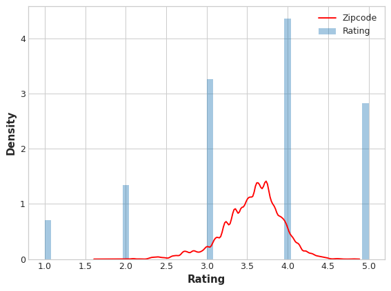

# Strategy to move ahead

- Check for corrs between all the features as well as the target (Perform a chi-squared test) with visualization
  - Check for corrs between:

    - [ ] The profession and degree feature

      - [ ] Check if there are any illegitimate relationsal tuples (like buisness analyst and mpharm degree):

        - Solution :

          - Use a crosstab method and then drop the illogical relations using a frequency threshold.

      - Teacher profession is adding imbalance to the data. I am sure of it. We need to deal with that.
    - [ ] The profession and working hours feature
    - [ ] The profession and target feature
    - [ ] Profession and financial Stress
    - [ ] Job satisfaction and financial stress
    - [ ] Check relation between city and sleep
    - [ ] Work pressure and study hours
- We also have to preprocess the data
  - Age can be categorized -> elow 10, below 20,etc
  - We can sort and categorize degrees accroding to their std deviation vs profession crosstab
    - Divide the degree into categories like specialized, generalized, random, etc.

- [ ] Check for data imbalance

  - We can experiment with making data more balanced by using SMOTE
  - We can also use a stratified sampling imputer to preserve the distribution of the dataset
  - We can use stratified sampling/ random sampling method to get proper data balance in the subsets and then perform cross-validation

- Then experiment with different models for different features

  - [ ] Exp 1:

    - Build a simple graident boosting model with all the features together
  - [ ] Exp 2:

    - Decide on contribution of uniformly distributed features and all other features
    - No need for dealing with data imbalance
    - Using simple ensemble-based/ gradient boostiing models
  - [ ] Exp 3:

    - Use catboost for categorical features
    - Use embeddings for profession and degree
    - Use a simple linear regression model for the numerical features
    - Use a stacking model to combine all these models to get the best results with regularization (L1 : used for feature selection, L2: used to prevent overfitting)

# Rough work

- Check whether there are enough records to train the model

  - We can also use a RareLabelEncoder to encode the rare values in the dataset
- Make sure to use redundancy for drop function
- As a part of model processing:

  - I think I can use categorical favoured models like CatBoost and LightGBM for cat features
  - Use embeddings for profession and degree since they can have good information and relation( i dont think they can b e particularly helpful, but if I get it working with KNN)
  - Finally use a simple linear regression model for the numerical features.
  - This way we can get the best of all worlds. Finally, I can use a stacking model to combine all these models to get the best results.
- Check for data imbalance

  - We can experiment with making data more balanced by using SMOTE
- We can experiment with making data more normally distributed and then checking the results
- I want to write a transformer for stratified sampling imputation/ random sampling imputation. How to write a transformer in sklearn?

# For later use

* Use MICE for imputation
* We can use a rare label encoder to encode the rare values in the dataset(only if necessary)

# Research

## Dealing with categorical values

#### Thinking of using a embedding model for profession

Here is a step-by-step plan to achieve this:

- Prepare the Data: Convert the 'Profession' column to a categorical type and then to integer codes.
- Create an Embedding Layer: Define an embedding layer in your neural network to learn the embeddings for the 'Profession' feature.
- Train the Neural Network: Train the neural network with the embedding layer included.

#### Dealing with missing values

##### **Advanced Techniques for Dealing with Missing Values**

###### 1. **Predictive Modeling (Imputation Using ML Models)**

* **Method** : Use machine learning algorithms to predict the missing values based on other features in the dataset.
* **Steps** :

1. Treat the feature with missing values as the target variable.
2. Train a regression (for numerical data) or classification model (for categorical data) using other features as predictors.
3. Predict missing values using the trained model.

* **Algorithms** : Random Forest, Gradient Boosting (XGBoost, LightGBM), K-Nearest Neighbors, etc.
* **Advantages** :
  * Leverages relationships between variables.
  * Handles both numerical and categorical data effectively.
* **Disadvantages** :
  * Computationally intensive.
  * Requires a separate model for each feature with missing values.

---

###### 2. **K-Nearest Neighbors (KNN) Imputation**

* **Method** : For each missing value, find the k-nearest rows (using a distance metric like Euclidean or cosine distance) and use their values to impute.
* **Advantages** :
  * Captures local relationships in the data.
* **Disadvantages** :
  * Computationally expensive for large datasets.
  * Sensitive to the choice of k and distance metric.

---

###### 3. **Multivariate Imputation by Chained Equations (MICE)**

* **Method** : Iteratively predicts missing values for each feature based on all other features in the dataset using regression models.
* **Advantages** :
  * Captures multivariate relationships.
  * Produces multiple imputations for uncertainty estimation.
* **Disadvantages** :
  * Computationally intensive.
  * Requires careful tuning of iteration parameters.

---

###### 4. **Matrix Factorization (e.g., SVD, PCA)**

* **Method** : Uses techniques like Singular Value Decomposition (SVD) or Principal Component Analysis (PCA) to approximate the data matrix and fill in missing values.
* **Advantages** :
  * Suitable for large-scale data.
  * Preserves global structure.
* **Disadvantages** :
  * Assumes linear relationships between variables.
  * May not work well if missing values are sparse.

---

###### 5. **Clustering-Based Imputation**

* **Method** : Use clustering algorithms (e.g., K-means, DBSCAN) to group similar data points and impute missing values based on cluster averages or modes.
* **Advantages** :
  * Captures local patterns.
* **Disadvantages** :
  * Requires pre-clustering of the data.
  * Sensitive to the quality of clustering.

---

###### 8. **Bayesian Imputation**

* **Method** : Use Bayesian models to impute missing values by treating them as latent variables and sampling from the posterior distribution.
* **Advantages** :

  * Accounts for uncertainty in imputations.
* **Disadvantages** :

  * Computationally intensive.
  * Requires expertise in Bayesian modeling

---

###### 9. Target encoding

The distribution of the encoded `Zipcode` feature roughly follows the distribution of the actual ratings, meaning that movie-watchers differed enough in their ratings from zipcode to zipcode that our target encoding was able to capture useful information.

MEstimatorEncoder class from scikit-learn can be used

---

###### 10. Categorical value embedding

https://cpa-analytics.github.io/embedding-encoder-intro/

---

###### 11. Count and frequency encoding

Count encoding consists of replacing the categories of categorical features by their counts, which are estimated from the training set. For example, in the variable color, if 10 observations are blue and 5 observations are red, blue will be replaced by 10 and red by 5.
